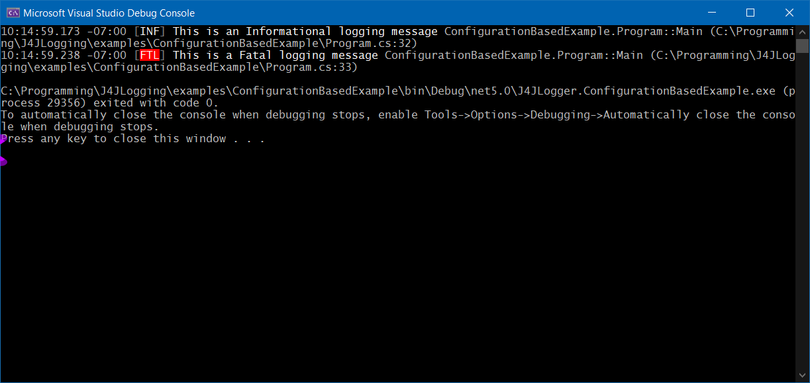

# J4JLogging

A Net library which wraps [Serilog's ILogger](https://github.com/serilog/serilog) and extends it by reporting source code information.

Licensed under GNU GPL-v3.0. See the [license file](license.md) for details.

[](https://www.nuget.org/packages/J4JSoftware.Logging/)

## TL;DR

```csharp
using System;
using System.IO;
using System.Linq;
using System.Runtime.CompilerServices;
using J4JSoftware.Logging;
using Microsoft.Extensions.Configuration;
using Serilog;

namespace ConfigurationBasedExample
{
    // shows how to use J4JLogger with a configuration file
    // see the ConfigurationBasedExample project for other files and details
    class Program
    {
        static void Main(string[] args)
        {
            var loggerConfig = new J4JLoggerConfiguration();

            var configRoot = new ConfigurationBuilder()
                .AddJsonFile( Path.Combine( Environment.CurrentDirectory, "appConfig.json" ), true )
                .Build();

            loggerConfig.SerilogConfiguration
                .ReadFrom
                .Configuration( configRoot );
                
            var logger = loggerConfig.CreateLogger();
            logger.SetLoggedType(typeof(Program));

            logger.Information("This is an Informational logging message");
            logger.Fatal("This is a Fatal logging message");
        }
    }
}
```

The console output looks like this:


The log file, log20210801.txt, looks like this:

```log
2021-09-15 10:14:59.173 -07:00 [INF] This is an Informational logging message ConfigurationBasedExample.Program::Main (C:\Programming\J4JLogging\examples\ConfigurationBasedExample\Program.cs:32) 
2021-09-15 10:14:59.238 -07:00 [FTL] This is a Fatal logging message ConfigurationBasedExample.Program::Main (C:\Programming\J4JLogging\examples\ConfigurationBasedExample\Program.cs:33) 
```

Your log file's name will be different because, by default, the log file rolls daily and the last day logging took place will be embedded in the file name.

There is a simple way of trimming the logged source code file paths to make them relative to the project directory path. See [trimming paths](trimming-paths.md) for how to do this.

You can read about how to use the `Serilog` `IConfiguration`-based configuration system [here](iconfig-based.md).

### Important Note

**There is one important difference in how you call the logging methods from the Serilog standard.**

If you pass nothing but simple strings to the methods as property values you **must** specify the types of the propertyValue arguments explicitly in the method call.

An example:

```csharp
string someStringValue = "abcd";
_logger.Debug<string>("The value of that argument is {0}", someStringValue);
```

This requirement comes about because the `memberName`, `srcPath` and `srcLine` arguments are automagically set for you by the compiler. The fact the `memberName` and `srcPath` arguments of the logging methods are strings makes them "collide" with string arguments you may specify. That makes explict type specifications for the arguments necessary when the compiler can't figure out what you mean...which is all too common :).

### Table of Contents

- [Change Log](changes.md)
- [Goal and Concept](goal-concept.md)
- [Configuration](configuration.md)
- [`IConfiguration`-based Configuration](iconfig-based.md)
- [NetEvent](netevent.md)
- [Usage](usage.md)
- [Managing SMS Messages](sms-messages.md)
- [Adding a new SMS Sink](new-sms.md)
