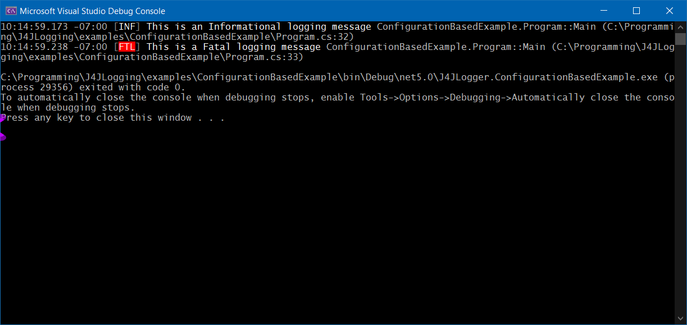

# J4JLogging

A Net 5.0 library which wraps [Serilog's ILogger](https://github.com/serilog/serilog) and extends it by reporting source code information.

Licensed under GNU GPL-v3.0. See the [license file](license.md) for details.

[](https://www.nuget.org/packages/J4JSoftware.Logging/)

### TL;DR

There are many breaking changes from the last release. **Please re-review the documentation**.

```csharp
using System;
using System.IO;
using System.Linq;
using System.Runtime.CompilerServices;
using J4JSoftware.Logging;
using Microsoft.Extensions.Configuration;
using Serilog;

namespace ConfigurationBasedExample
{
    // shows how to use J4JLogger with a configuration file
    // see the ConfigurationBasedExample project for other files and details
    class Program
    {
        static void Main(string[] args)
        {
            var loggerConfig = new J4JLoggerConfiguration()
                {
                    // this assignment is optional but useful (see Trimming Paths below)
                    CallingContextToText = ConvertCallingContextToText
                }
                .AddEnricher<CallingContextEnricher>();

            var configRoot = new ConfigurationBuilder()
                .AddJsonFile( Path.Combine( Environment.CurrentDirectory, "appConfig.json" ), true )
                .Build();

            loggerConfig.SerilogConfiguration
                .ReadFrom
                .Configuration( configRoot );
                
            var logger = loggerConfig.CreateLogger();
            logger.SetLoggedType(typeof(Program));

            logger.Information("This is an Informational logging message");
            logger.Fatal("This is a Fatal logging message");
        }

        // these next two functions are a simple way to trim the source code file
        // paths to remove the path to the root of the project directory (which
        // tends to be long and redundant)
        //
        // the code of these two functions can simply be copied into a source
        // code file in any project and then referenced similar to what was done here.
        private static string ConvertCallingContextToText(
            Type? loggedType,
            string callerName,
            int lineNum,
            string srcFilePath)
        {
            return CallingContextEnricher.DefaultConvertToText(loggedType,
                callerName,
                lineNum,
                CallingContextEnricher.RemoveProjectPath(srcFilePath, GetProjectPath()));
        }

        private static string GetProjectPath([CallerFilePath] string filePath = "")
        {
            var dirInfo = new DirectoryInfo(Path.GetDirectoryName(filePath)!);

            while (dirInfo.Parent != null)
            {
                if (dirInfo.EnumerateFiles("*.csproj").Any())
                    break;

                dirInfo = dirInfo.Parent;
            }

            return dirInfo.FullName;
        }
    }
}
```

The console output looks like this:


The log file, log20210801.txt, looks like this:

```log
2021-09-13 19:19:04.828 -07:00 [INF] This is an Informational logging message ConfigurationBasedExample.Program::Main (\Program.cs:33) 
2021-09-13 19:19:04.875 -07:00 [FTL] This is a Fatal logging message ConfigurationBasedExample.Program::Main (\Program.cs:34) 
```

Your log file's name will be different because, by default, the log file rolls daily and the last day logging took place will be embedded in the file name.

### Trimming Paths

The example here uses two static methods, `ConvertCallingContextToText` and `GetProjectPath`, which
at first glance don't appear to do anything. In reality, what they do is determine the path to the
project's root which, in turn, is used to trim the source code file paths so that they don't get
"too long".

Those two static methods can be incorporated in any project, as is, and used as they are in this
example.

### The Configuration File

This example uses `Serilog`'s `IConfiguration`-based add-on to automagically configure the `Serilog`
logger underlying `J4JLogger`. You should consult the github site for details, but the configuration file syntax is pretty simple:

```json
  "Serilog": {
    "MinimumLevel": "Information",
    "Using": [ "Serilog.Sinks.Console", "Serilog.Sinks.File", "Serilog.Sinks.Debug" ],
    "WriteTo": [
      {
        "Name": "Console",
        "Args": {
          "outputTemplate": "{Timestamp:HH:mm:ss.fff zzz} [{Level:u3}] {Message:lj} {CallingContext} {Exception}{NewLine}"
        }
      },
      {
        "Name": "Debug",
        "Args": {
          "outputTemplate": "{Timestamp:HH:mm:ss.fff zzz} [{Level:u3}] {Message:lj} {CallingContext} {Exception}"
        }
      },
      {
        "Name": "File",
        "Args": {
          "path": "log.txt",
          "rollingInterval": "Day",
          "outputTemplate": "{Timestamp:yyyy-MM-dd HH:mm:ss.fff zzz} [{Level:u3}] {Message:lj} {CallingContext} {Exception}{NewLine}"
        }
      }
    ]
  }
```

### Important Note

**There is one important difference in how you call the logging methods
from the Serilog standard.** 

If you pass nothing but simple strings to the methods as property values you **must** specify the types of 
the propertyValue arguments explicitly in the method call. 

An example:

```csharp
string someStringValue = "abcd";
_logger.Debug<string>("The value of that argument is {0}", someStringValue);
```

This requirement comes about because the `memberName`, `srcPath` and `srcLine` 
arguments are automagically set for you by the compiler. The fact the 
`memberName` and `srcPath` arguments of the logging methods are strings and
"collide" with string arguments you may specify. That makes explict type 
specifications for the arguments necessary when strings are referenced by the message template.

### Table of Contents

- [Change Log](docs/changes.md)
- [Goal and Concept](docs/goal-concept.md)
- [Terminology](docs/terminology.md)
- [Usage](docs/usage.md)
- [Configuration](docs/configuration.md)
- [The Twilio channel](docs/twilio.md)
- [Adding a channel](docs/channel.md)
