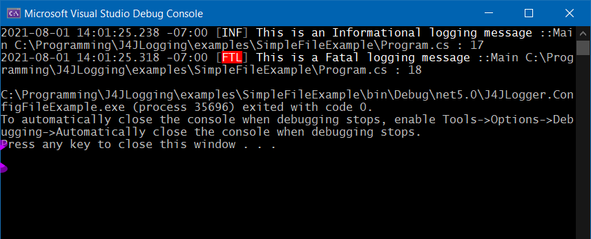

# J4JLogging

A Net 5.0 library which wraps [Serilog's ILogger](https://github.com/serilog/serilog) and extends it by
reporting source code information.

Licensed under GNU GPL-v3.0. See the [license file](license.md) for details.

[](https://www.nuget.org/packages/J4JSoftware.Logging/)

### TL;DR
There are many breaking changes from the last release. *Please re-review the documentation**.

```csharp
using J4JSoftware.Logging;

namespace J4JLogger.Examples
{
    // shows how to use J4JLogger witout a configuration file
    class Program
    {
        static void Main(string[] args)
        {
            var logger = new J4JSoftware.Logging.J4JLogger();
            logger.AddDebug();
            logger.AddConsole();
            logger.AddFile();

            logger.SetLoggedType<Program>();

            logger.Information("This is an Informational logging message");
            logger.Fatal("This is a Fatal logging message");
        }
    }
}
```
The console output looks like this:


The log file, log20210801.txt, looks like this:
```
2021-08-01 13:23:12.460 -07:00 [INF] This is an Informational logging message ::Main C:\Programming\J4JLogging\examples\SimpleFileExample\Program.cs : 18
2021-08-01 13:23:12.535 -07:00 [FTL] This is a Fatal logging message ::Main C:\Programming\J4JLogging\examples\SimpleFileExample\Program.cs : 19
```
Your log file's name will be different because, by default, the log file rolls daily and the last day logging
took place will be embedded in the file name.

### Important Note
**There is one important difference in how you call the logging methods
from the Serilog standard.** 

If you pass nothing but simple strings to the methods as property values you **must** specify the types of 
the propertyValue arguments explicitly in the method call. 

An example:

```csharp
string someStringValue = "abcd";
_logger.Debug<string>("The value of that argument is {0}", someStringValue);
```
This requirement comes about because the `memberName`, `srcPath` and `srcLine` 
arguments are automagically set for you by the compiler. The fact the 
`memberName` and `srcPath` arguments of the logging methods are strings and
"collide" string arguments you may specify. That makes explict type 
specifications for the arguments necessary when strings are referenced by the message template.

### Table of Contents

- [Change Log](docs/changes.md)
- [Goal and Concept](docs/goal-concept.md)
- [Terminology](docs/terminology.md)
- [Usage](docs/usage.md)
- [Configuration](docs/configuration.md)
- [The Twilio channel](docs/twilio.md)
- [Adding a channel](docs/channel.md)

#### Inspiration and Dedication

I'm a huge fan of [Serilog](https://serilog.net/) and use it in all of my 
C# work. This library is dedicated to Nicholas Blumhardt and the rest of
the Serilog team.

But I wanted to be able to annotate the log messages with source code information because that's 
useful during debugging and I wanted to be able to send SMS messages about some log events.

**J4JLogging** is my approach to doing both those things. It's a simple wrapper for Serilog 
which makes it easy to include caller information, source code information and sending text 
messages via Twilio for selected log events.